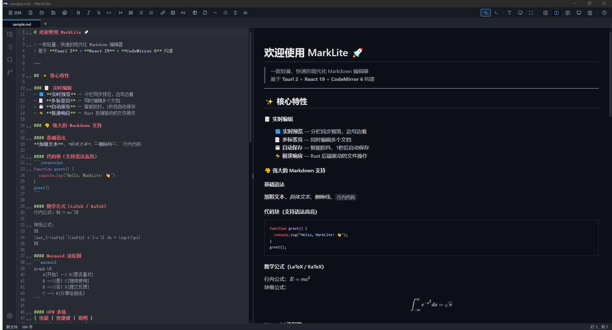

# MarkLite

<p align="center">
  <strong>一款轻量、快速的桌面 Markdown 编辑器</strong><br/>
  基于 <strong>Tauri 2</strong> + <strong>React 19</strong> + <strong>CodeMirror 6</strong> 构建
</p>

<p align="center">



</p>

<p align="center">
  <a href="./docs/USER_GUIDE.md">中文用户手册</a> &nbsp;|&nbsp;
  <a href="#✨-features">功能特性</a> &nbsp;|&nbsp;
  <a href="#getting-started">快速开始</a> &nbsp;|&nbsp;
  <a href="#tech-stack">技术栈</a>
</p>

---

## ✨ Features

### 📝 编辑核心
- **Live Preview** — 实时分栏预览，编辑器与预览区同步滚动
- **Multi-Tab Editing** — 多标签页同时编辑，支持拖拽排序和右键菜单
- **Syntax Highlighting** — CodeMirror 6 驱动的代码高亮，支持 Markdown / JavaScript / Python / CSS / HTML 等语言
- **Auto-Save** — 智能防抖自动保存（1 秒延迟），内容无变化时跳过写入
- **Auto Brackets** — 自动补全括号、引号等成对符号
- **Vim Mode** — 可选 Vim 键盘模式，工具栏 Terminal 图标一键切换，默认关闭
- **Line Numbers & Fold Gutter** — 行号显示与代码折叠
- **Cursor Position** — 实时显示光标行列位置
- **📸 Image Paste** — 从剪贴板粘贴图片或拖拽图片，自动保存到本地并插入 Markdown 链接
- **✏️ Toolbar Formatting** — 一键格式化工具栏，涵盖：
  - 加粗、斜体、删除线、行内代码
  - 标题（循环升级 H1→H6）、引用块、无序/有序列表、任务列表
  - 代码块、分割线、链接、图片（本地/链接）、数学公式
  - **表格尺寸选择器** — 悬停 8×8 网格，点击即插入带表头的完整 Markdown 表格
- **📋 Right-Click Context Menu** — 编辑器内右键菜单，支持上下文感知的操作（20+个菜单项），可在表格内直接编辑
- **🎯 Writing Statistics** — 实时字数、字符数、句子数、阅读时间统计
- **⌨️ Custom Shortcuts** — 支持自定义快捷键绑定
- **🔗 Wiki-Link 导航** — `[[target]]` 语法支持文档间快速导航，单击或 Ctrl+Click 打开/创建链接文档，自动识别同文件夹内已存在的文档
- **🔭 命令面板** — `Ctrl+Shift+P` 快速命令执行，支持 20+ 核心操作的模糊搜索与最近命令优先排序
- **📌 片段管理器** — 文本模板与动态变量支持（`${date}`、`${time}`、`${filename}`、`${cursor}`），创建/编辑/删除片段，一键快速插入常用内容
- **🖱️ 多光标编辑** — `Alt+D` 选中当前单词的所有出现，`Alt+Up/Down` 在上/下一行添加光标，支持并行输入和删除

### 🎨 视图与主题
- **Three View Modes** — 仅编辑 / 分栏（默认）/ 仅预览，快捷键一键切换
- **Multiple Themes** — 四种主题：
  - ☀️ **Light** — GitHub Light 风格亮色主题
  - 🌙 **Dark** — GitHub Dark 暗色主题
  - 📜 **Sepia** — 护眼棕色调主题
  - 🔲 **High Contrast** — 高对比度主题
- **System Theme Follow** — 可选跟随操作系统深色模式，持久化到 localStorage
- **Focus Modes** — 三种专注模式：
  - 📝 **打字机模式** (Typewriter) — 当前行始终居中显示，隐藏工具栏与状态栏
  - 🖥️ **专注模式** (Focus) — 仅保留编辑器，暗化 UI，沉浸式写作
  - 🔲 **全屏模式** (Fullscreen) — 占满整个屏幕，按 ESC 或 F11 退出
- **Synchronized Scrolling** — 分栏模式下编辑区与预览区联动滚动
- **Welcome Page** — 空标签页欢迎页面，展示快捷操作入口和快捷键提示

### 🔍 搜索与导航
- **Find & Replace** — 全功能查找替换工具栏（`Ctrl+F` / `Ctrl+H`），支持：
  - 大小写敏感匹配 (`Aa`)
  - 正则表达式搜索 (`.*`)
  - 逐个/全部替换
  - 编辑器内高亮定位匹配项
- **Table of Contents (TOC)** — 左侧大纲侧边栏，自动提取 H1-H6 标题，支持折叠/展开子节点，点击跳转
- **Cross-File Search** — 在整个文件夹中搜索与替换，支持大小写敏感、正则表达式、未保存内容搜索
- **File Tree Sidebar** — 打开文件夹后，左侧显示文件树，支持双击打开、搜索过滤、新建/删除/重命名文件

### 📤 导出格式
- **DOCX** — 导出为 Word 文档（通过 Rust 后端渲染，支持 Mermaid 图表和数学公式）
- **PDF** — 导出为 PDF 文件（通过 Rust 后端渲染）
- **HTML** — 导出为独立 HTML 文件（前端生成，含完整样式）
- **PNG** — 导出为 PNG 图片（基于 html2canvas）
- **EPUB** — 导出为电子书格式（EPUB2/EPUB3），动态导入 epub-gen，从 YAML Frontmatter 提取元数据（标题、作者、描述）

### 📐 富文本预览 (GFM+)
- **GFM Support** — 表格、任务列表、删除线、自动链接、脚注等
- **Math / LaTeX** — KaTeX 数学公式渲染（行内 `$...$` 与块级 `$$...$$`）
- **Mermaid Diagrams** — 流程图、时序图、饼图等图表渲染为 SVG
- **Code Highlighting** — highlight.js 驱动的代码块语法高亮
- **Custom Directives** — remark-directive 自定义容器支持
- **Footnotes** — 脚注定义 `[^1]` 与引用，预览自动渲染为链接
- **YAML Frontmatter** — 文档元数据支持，预览显示为表格
- **Table Editor** — 可视化编辑表格（双击或右键菜单打开，支持添加/删除行列、调整对齐）

### 💾 文件操作
- **Open / Save / Save As** — 原生文件对话框，支持 `.md` / `.markdown` / `.txt`
- **Drag & Drop** — 直接将 `.md` 文件拖入编辑器打开
- **CLI Integration** — 支持从命令行/文件管理器双击打开文件（`get_open_file` Tauri command）
- **File Tree CRUD** — 在文件树中直接新建、删除、重命名文件
- **Version Snapshots** — 本地版本快照系统（基于 localStorage）：
  - 每次手动保存时自动创建快照（最多保留 20 个）
  - 状态栏显示快照数量，点击可浏览历史版本
  - 一键恢复到任意历史快照

### 🌐 国际化
- **中英文双语** — 完整 i18n 覆盖，所有 UI 文本支持中/英切换
- **Settings Panel** — 统一设置弹窗，管理主题、语言、快捷键等偏好

### ⌨️ 键盘快捷键

| 快捷键 | 功能 |
|--------|------|
| `Ctrl+N` | 新建标签页 |
| `Ctrl+O` | 打开文件 |
| `Ctrl+S` | 保存 |
| `Ctrl+Shift+S` | 另存为 |
| `Ctrl+W` | 关闭当前标签页 |
| `Ctrl+F` / `Ctrl+H` | 打开查找替换 |
| `Ctrl+1` | 切换到仅编辑视图 |
| `Ctrl+2` | 切换到分栏视图 |
| `Ctrl+3` | 切换到仅预览视图 |
| `Ctrl+.` | 打字机模式开关 |
| `Ctrl+,` | 专注模式开关 |
| `Ctrl+Shift+P` | 命令面板（模糊搜索核心操作） |
| `Alt+D` | 选中当前单词的所有出现（多光标） |
| `Alt+Up` | 在上一行添加光标 |
| `Alt+Down` | 在下一行添加光标 |
| `Ctrl+Click` | Wiki-link 导航（创建/打开链接文档） |
| `ESC` | 退出焦点模式 / 关闭搜索栏 |

## Tech Stack

| Layer | Technology |
|-------|-----------|
| Desktop Shell | [Tauri 2](https://v2.tauri.app/) (Rust) |
| Frontend | [React 19](https://react.dev/) + TypeScript ~5.8 |
| Editor Engine | [CodeMirror 6](https://codemirror.net/) via [@uiw/react-codemirror](https://github.com/uiwjs/react-codemirror) |
| Preview Renderer | [react-markdown](https://github.com/remarkjs/react-markdown) + remark/rehype 插件链 |
| Styling | [Tailwind CSS 4](https://tailwindcss.com/) (CSS Variables 主题系统) |
| Build Tool | [Vite 7](https://vite.dev/) |
| Testing | [Vitest](https://vitest.dev/) + @testing-library/react |

### Key Dependencies

- **Editor:** `@codemirror/*` (autocomplete, commands, fold, lang-*, search, state, view, theme-one-dark)
- **Preview:** `react-markdown`, `remark-gfm`, `remark-math`, `rehype-highlight`, `rehype-katex`
- **Diagrams:** `mermaid` ^11
- **Math:** `katex` ^0.16
- **Icons:** `lucide-react`
- **Split Pane:** `react-split`
- **Tauri Plugins:** `plugin-dialog`, `plugin-fs`, `plugin-opener`

## Prerequisites

- [Node.js](https://nodejs.org/) >= 18
- [Yarn](https://yarnpkg.com/) >= 1.22
- [Rust](https://www.rust-lang.org/tools/install) (latest stable)
- Platform-specific Tauri dependencies — see [Tauri prerequisites](https://v2.tauri.app/start/prerequisites/)

## Getting Started

```bash
# Clone the repository
git clone https://github.com/lin51kevin/md-client.git
cd md-client

# Install dependencies
yarn install

# Run in development mode
yarn tauri dev

# Build for production
yarn tauri build
```

## Project Structure

```
marklite/
├── src/                        # React frontend
│   ├── components/             # UI 组件
│   │   ├── Toolbar.tsx         # 工具栏（文件菜单/格式化/切换/视图/标签导航）
│   │   ├── ToolbarButton.tsx   # 工具栏通用按钮（action/toggle/view 变体）
│   │   ├── TableSizePicker.tsx # 表格尺寸网格选择器
│   │   ├── TabBar.tsx          # 标签栏（多标签/拖拽排序/右键菜单/滚动）
│   │   ├── StatusBar.tsx       # 状态栏（路径/字数统计/行列号/版本历史入口）
│   │   ├── FindReplaceBar.tsx  # 查找替换栏
│   │   ├── MarkdownPreview.tsx # Markdown 渲染预览（含 Mermaid/KaTeX）
│   │   ├── TocSidebar.tsx      # 大纲导航侧边栏（可折叠标题树）
│   │   ├── FileTreeSidebar.tsx # 文件树侧边栏（CRUD/搜索过滤）
│   │   ├── SearchPanel.tsx     # 跨文件搜索面板
│   │   ├── EditorContextMenu.tsx # 编辑器右键上下文菜单
│   │   ├── FileMenuDropdown.tsx # 文件菜单下拉
│   │   ├── SettingsModal.tsx   # 设置面板（主题/语言/快捷键）
│   │   ├── WelcomePage.tsx     # 空标签页欢迎页
│   │   ├── TableEditor.tsx     # 表格可视化编辑器
│   │   ├── InputDialog.tsx     # 通用输入对话框
│   │   ├── DragOverlay.tsx     # 拖拽覆盖层提示
│   │   ├── HelpModal.tsx       # 内置用户手册弹窗（带可折叠 TOC 侧边栏）
│   │   ├── EditorContentArea.tsx # 主编辑区域布局（分栏/编辑/预览模式）
│   │   └── TabContextMenu.tsx  # 标签右键菜单
│   ├── hooks/                  # 自定义 React Hooks
│   │   ├── useTabs.ts          # 标签页状态管理
│   │   ├── useFileOps.ts       # 文件打开/保存/导出
│   │   ├── useScrollSync.ts    # 编辑器-预览同步滚动
│   │   ├── useDragDrop.ts      # 文件拖放处理
│   │   ├── useKeyboardShortcuts.ts # 全局快捷键绑定
│   │   ├── useCursorPosition.ts # 光标位置追踪
│   │   ├── useFocusMode.ts     # 焦点模式（打字机/专注/全屏）
│   │   ├── useSearchHighlight.ts # 搜索结果高亮
│   │   ├── useFormatActions.ts # 格式化操作
│   │   ├── useImagePaste.ts    # 图片粘贴处理
│   │   ├── useWindowTitle.ts   # 窗口标题同步
│   │   ├── useInputDialog.ts   # React 状态驱动的输入对话框
│   │   ├── useDocMetrics.ts    # 防抖文档分析（TOC + 字数统计）
│   │   ├── useVersionHistory.ts # 版本快照生命周期（保存时自动创建）
│   │   ├── useTableEditor.ts   # 表格编辑器弹窗状态管理
│   │   ├── useSnippetFlow.ts   # 片段选择/管理器状态与插入逻辑
│   │   └── useEditorInstance.ts # CodeMirror 编辑器生命周期管理
│   ├── i18n/                   # 国际化
│   │   ├── en.ts               # 英文语言包
│   │   └── zh-CN.ts            # 中文语言包
│   ├── lib/                    # 工具库
│   │   ├── auto-save.ts        # 防抖自动保存引擎
│   │   ├── theme.ts            # 亮/暗主题定义与切换
│   │   ├── theme-auto.ts       # 系统主题跟随
│   │   ├── cm-themes.ts        # CodeMirror 额外主题（Sepia/High-Contrast）
│   │   ├── version-history.ts  # 本地版本快照系统
│   │   ├── toc.ts              # TOC 标题提取算法
│   │   ├── word-count.ts       # 字数统计
│   │   ├── writing-stats.ts    # 写作统计
│   │   ├── search.ts           # 搜索/替换引擎
│   │   ├── mermaid.ts          # Mermaid 图表渲染
│   │   ├── html-export.ts      # HTML 导出生成
│   │   ├── export-prerender.ts # 导出预渲染（Mermaid/Math）
│   │   ├── latex.ts            # LaTeX 处理
│   │   ├── image-paste.ts      # 图片粘贴工具
│   │   ├── text-format.ts      # 文本格式化工具
│   │   ├── table-parser.ts     # 表格解析器
│   │   ├── context-menu.ts     # 右键菜单逻辑
│   │   ├── shortcuts-config.ts # 快捷键配置
│   │   ├── recent-files.ts     # 最近文件管理
│   │   ├── split-preference.ts # 分栏比例记忆
│   │   ├── cmAutocomplete.ts   # CodeMirror 自动补全括号
│   │   └── cmVim.ts            # Vim 模式集成
│   ├── __tests__/              # 单元测试
│   ├── App.tsx                 # 主应用组件
│   ├── types.ts                # TypeScript 类型定义
│   ├── constants.ts            # 常量与默认值
│   └── main.tsx                # 应用入口
├── src-tauri/                  # Tauri (Rust) 后端
│   ├── src/                    # Rust 源码
│   ├── capabilities/           # 权限配置
│   ├── icons/                  # 应用图标
│   └── tauri.conf.json         # Tauri 配置
├── package.json
├── vitest.config.ts            # 测试配置
└── CHANGELOG.md                # 变更日志
```

## Changelog

This project uses [git-chglog](https://github.com/git-chglog/git-chglog) to generate changelogs from git commit history.

```bash
# Generate full CHANGELOG.md (all versions)
yarn changelog

# Preview latest version only
yarn changelog:latest

# Manual usage (requires git-chglog installed)
git-chglog                    # Preview all
git-chglog -o CHANGELOG.md    # Write to file
git-chglog v0.1.0..           # Changes since v0.1.0
```

**Note**: Commits should follow [Conventional Commits](https://www.conventionalcommits.org/) format:
- `feat:` → Added
- `fix:` → Fixed
- `perf:` → Performance
- `refactor:` / `chore:` → Changed

## Contributing

Contributions are welcome! Please read [CONTRIBUTING.md](CONTRIBUTING.md) before submitting a PR.

## License

This project is licensed under the [MIT License](LICENSE).
