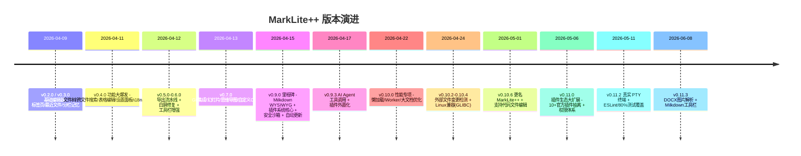

# MarkLite++ 项目综合分析

> 最后更新：2026-07-09 | 基于 MarkLite++ v0.11.3
> 数据来源：CHANGELOG.md、docs/guides/FEATURE\_COMPARISON.md、docs/CODEMAPS/ARCHITECTURE.md、源码结构

MarkLite++ 是基于 **Tauri 2 + React 19 + CodeMirror 6** 的桌面 Markdown & 代码编辑器（MIT 开源）。本文从功能点、竞品对比、开发历程、关键时间点与研发特点五个维度进行综合分析。

***

## 一、功能点总结

核心功能分为七大模块：

### 1. 编辑核心

* **双引擎编辑**：CodeMirror 6 源码编辑 + Milkdown Crepe WYSIWYG 预览区直接编辑，双向同步

* **AST 精准块级编辑**：通过 Markdown AST 定位源码，段落 / 标题 / 引用 / 列表 / 代码块原地编辑，含完整 undo/redo

* 多标签页（拖拽排序、Pin、重命名）、多光标编辑、Vim 模式、自动保存（1s 防抖）、自动括号补全、图片粘贴 / 拖拽

### 2. 视图与主题

* 三视图模式（仅编辑 / 分栏 / 仅预览）、四主题（Light / Dark / Sepia / High-Contrast）、跟随系统深色模式

* 三种专注模式（打字机 / 专注 / 全屏）、同步滚动、欢迎页

### 3. 搜索与导航

* 查找替换（正则 / 大小写）、TOC 大纲、跨文件全文搜索、Wiki-Link 导航、命令面板（Ctrl+Shift+P）、文件树 CRUD

### 4. 内容增强

* KaTeX 公式、Mermaid 图表、脚注、YAML Frontmatter、100+ 语言高亮、表格可视化编辑、自定义容器（`:::info`）

### 5. 导出

* **PDF / DOCX / HTML / EPUB / PNG** 五种格式，Rust 后端渲染（支持 Mermaid 图与公式预渲染、本地图片解析）

### 6. 插件生态

* 完整插件 API（files / preview / export / settings / theme / commands / workspace 等命名空间）

* **权限沙箱系统**（细粒度权限、审批弹窗、清单字段消毒）

* 18+ 官方插件：AI Copilot、Git、Vim、Mermaid、KaTeX、Terminal（真实 PTY）、Minimap、Graph View、Daily Notes、Tag System 等

### 7. 辅助工具

* AI Copilot（改写 / 解释 / 翻译 / 总结，OpenAI 兼容）、片段管理器（变量替换）、本地版本快照、写作统计、i18n（中 / 英 / 日）

***

## 二、主流 Markdown 应用优劣对比

| 工具               | 定位          | 优势                                                                                  | 劣势                                             |
| ---------------- | ----------- | ----------------------------------------------------------------------------------- | ---------------------------------------------- |
| **MarkLite++**   | 轻量桌面编辑器     | 免费开源；双引擎编辑（源码 + WYSIWYG）；AST 精准编辑带 undo/redo；多标签 + 多光标；EPUB/PNG 导出；插件权限沙箱；Tauri 体积小 | 无移动端 / Web 版；主题与插件生态数量远少于 Obsidian/VSCode；相对年轻 |
| **Typora**       | WYSIWYG 编辑器 | 无缝所见即所得，渲染体验最佳；启动快                                                                  | 闭源收费（¥89）；无多标签、无多光标、无跨文件搜索；扩展性弱                |
| **Obsidian**     | 知识管理 / PKM  | 双链笔记、知识图谱、庞大社区插件生态；跨端（付费）                                                           | 核心闭源；PDF/DOCX 导出需付费插件；偏 PKM 而非纯编辑              |
| **VS Code + 插件** | 通用代码编辑器     | 与开发工作流深度集成；扩展生态最大；免费开源                                                              | 无原生 WYSIWYG；Markdown 体验依赖插件拼装；偏重代码而非写作         |
| **Mark Text**    | 开源编辑器       | 界面干净，格式支持完整，免费                                                                      | 无多标签 / 多光标；无跨文件搜索；无 DOCX/EPUB 导出；项目活跃度低        |

**差异化定位**：MarkLite++ 填补「Typora 的所见即所得体验」与「VS Code 的多标签 / 多光标 / 插件化」之间的空白，同时保持完全免费开源。

***

## 三、开发历程与关键时间点

整个项目在 **约两个月内（2026-04-09 → 2026-06-08）** 从 v0.2.0 迭代到 v0.11.3，节奏极快。

### 关键转折点分析

1. **v0.4.0（04-11）— 功能奠基期**：单版本引入文件树、跨文件搜索、表格可视化编辑、设置面板、i18n 全量、快捷键自定义、PNG 导出。采用 F0xx 功能编号 + TDD，是产品从「Demo」走向「可用产品」的分水岭。

2. **v0.9.0（04-15）— 架构质变期**：三件大事同时落地——① 用 Milkdown Crepe 替换 react-markdown，实现真正的 WYSIWYG 编辑；② 建立插件系统核心；③ 引入安全沙箱 + 权限模型 + 自动更新。项目从「编辑器」升级为「可扩展平台」。

3. **v0.10.0（04-22）— 性能攻坚期**：集中处理懒加载、Web Worker 卸载大文档、React.memo 抑制重渲染、highlight.js 分层加载。标志产品进入「优化打磨」阶段。

4. **v0.10.6（05-01）— 品牌重定位**：更名 MarkLite → **MarkLite++**，从纯 Markdown 扩展到通用代码文件编辑，扩大目标用户。

5. **v0.11.0（05-06）— 生态成型期**：将 Mermaid、Vim、PNG、Minimap、Terminal 等核心能力抽离为 10+ 官方插件，引入专用权限（shell.execute / git.command），确立「微内核 + 插件」架构。

6. **v0.11.2（05-11）— 工程规范化**：接入真实 PTY 终端、加入 ESLint/Prettier、测试覆盖率提升至 80%，标志工程质量体系成熟。

***

## 四、研发特点汇总

1. **高速迭代、小步快跑**：两个月内 20+ 个版本，几乎每 1-2 天一个发布，CHANGELOG 严格遵循 Keep a Changelog + 语义化版本。

2. **TDD 驱动 + 质量前置**：贯穿始终的 TDD（F0xx 功能编号追踪）、code review 修复、happy-dom 测试环境、最终 80% 覆盖率 + ESLint/Prettier 工程化。

3. **安全优先**：路径穿越防护、Shell 命令白名单、插件权限沙箱、清单字段消毒、UTF-16 偏移修复——安全问题作为独立 changelog 类别持续跟踪。

4. **持续架构演进**：从 props-drilling → Zustand store；从巨型 App.tsx → 拆分为 AppProviders / AppShell + 多个聚合 hook；从内置功能 → 微内核插件化。体现「先跑通、再重构」的务实路线。

5. **性能敏感**：Web Worker 卸载、懒加载、React.memo、Rust release profile（`opt-level = "z"` + LTO + strip）追求小体积高性能，充分发挥 Tauri 优势。

6. **前后端职责清晰**：Rust 后端专注 I/O、导出、PTY、路径校验等原生能力；React 前端专注编辑体验，通过 Tauri IPC 解耦。

7. **产品化完整度高**：i18n（中 / 英 / 日）、自动更新、外部文件变更检测、欢迎页、内置手册、Windows 右键集成、跨平台（Win / macOS / Linux）——具备成熟商业软件的完整度。

