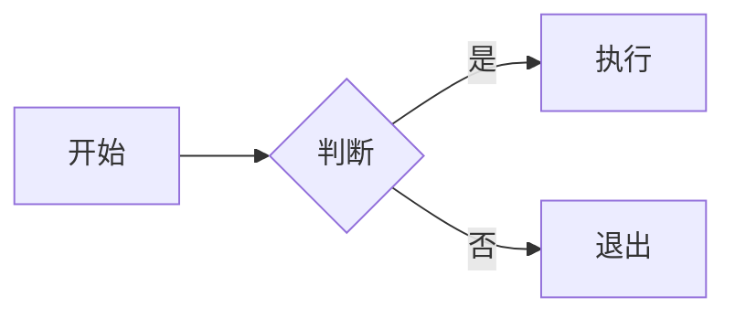

# MarkLite 用户手册

> 最后更新：2026-04-09 | 适用版本：0.3.0+

---

## 📖 目录

1. [快速上手](#1-快速上手)
2. [界面介绍](#2-界面介绍)
3. [文件操作](#3-文件操作)
4. [编辑功能](#4-编辑功能)
5. [视图模式](#5-视图模式)
6. [主题与外观](#6-主题与外观)
7. [焦点模式](#7-焦点模式)
8. [搜索与替换](#8-搜索与替换)
9. [大纲导航](#9-大纲导航)
10. [导出文档](#10-导出文档)
11. [版本历史](#11-版本历史)
12. [Markdown 语法支持](#12-markdown-语法支持)
13. [键盘快捷键](#13-键盘快捷键)
14. [常见问题](#14-常见问题)

---

## 1. 快速上手

### 1.1 安装运行

```bash
# 克隆项目
git clone https://github.com/lin51kevin/md-client.git
cd md-client

# 安装依赖
yarn install

# 开发模式运行
yarn tauri dev

# 构建生产版本
yarn tauri build
```

### 1.2 启动应用

运行 `yarn tauri dev` 后，应用窗口会自动打开。新用户会看到空白的编辑器，可以立即开始输入 Markdown 内容。

### 1.3 打开已有文件

- 点击工具栏的 **「打开」** 按钮
- 或使用快捷键 **Ctrl+O**
- 支持直接拖拽 `.md` / `.markdown` / `.txt` 文件到编辑器窗口

---

## 2. 界面介绍

```
┌─────────────────────────────────────────────────────────┐
│  Toolbar（工具栏）: 新建 | 打开 | 保存 | 导出 | 视图切换  │
├─────────────────────────────────────────────────────────┤
│  TabBar（标签栏）: [文件1.md] [文件2.md] [未命名+]        │
├──────────────┬────────────────────────┬─────────────────┤
│              │                        │                 │
│   TOC        │    Editor              │   Preview       │
│   大纲       │    编辑器              │   预览          │
│   侧边栏     │    (CodeMirror 6)     │   (实时渲染)    │
│   (可折叠)   │                        │                 │
│              │                        │                 │
├──────────────┴────────────────────────┴─────────────────┤
│  StatusBar（状态栏）: 文件路径 | 字数 | 行/列 | 版本历史   │
└─────────────────────────────────────────────────────────┘
```

### 工具栏按钮说明

| 按钮 | 功能 |
|------|------|
| 新建 | 创建空白标签页 |
| 打开 | 打开本地 Markdown 文件 |
| 保存 | 保存当前文件（Ctrl+S）|
| 另存为 | 另存为新文件 |
| 导出DOCX | 导出为 Word 文档 |
| 导出PDF | 导出为 PDF 文件 |
| 导出HTML | 导出为 HTML 文件 |
| 大纲 | 显示/隐藏左侧大纲导航 |
| ☀️/🌙 | 切换亮色/暗色主题 |
| 打字机 | 开启打字机模式 |
| 专注 | 开启专注模式 |
| 全屏 | 进入/退出全屏模式 |
| 编辑/分栏/预览 | 切换视图模式 |

---

## 3. 文件操作

### 3.1 打开文件

- **工具栏按钮**：「打开」→ 选择 `.md` / `.markdown` / `.txt` 文件
- **快捷键**：`Ctrl+O`（可多选，一次打开多个文件）
- **拖拽**：直接将文件拖入编辑器窗口
- **命令行**：支持从终端用文件路径参数启动应用：
  ```bash
  ./marklite ~/Documents/readme.md
  ```

### 3.2 保存文件

- **手动保存**：`Ctrl+S`
- **另存为**：`Ctrl+Shift+S` → 选择新路径保存
- **自动保存**：编辑停止 1 秒后自动保存到原路径（首次保存需手动指定路径）

### 3.3 多标签操作

- **新建标签**：`Ctrl+N` 或点击标签栏右侧 `+` 按钮
- **切换标签**：点击标签或 `Ctrl+Tab`
- **关闭标签**：`Ctrl+W` 或点击标签右侧 `×` 按钮
- **拖拽排序**：长按标签拖动到目标位置
- **右键菜单**：右键点击标签可快速保存/另存为/关闭

---

## 4. 编辑功能

### 4.1 行号与折叠

编辑器左侧显示**行号**，支持**代码折叠**（点击折叠标记 `▼` 可折叠对应区块）。

### 4.2 自动补全

- **括号自动补全**：输入 `[`、`(`、`{`、`"` 等符号时自动补全配对符号
- **Vim 模式**（可选）：集成 Replit CodeMirror Vim，支持 `hjkl` 移动、`i/a/o` 进入编辑等 Vim 操作（异步加载，无需手动开启）

### 4.3 字数统计

状态栏实时显示**字数**（以空格和换行分割的中英文混合统计）。

### 4.4 光标位置

状态栏右侧显示当前**行列号**，格式：`行 X，列 Y`。

---

## 5. 视图模式

应用提供三种视图模式，可通过工具栏按钮或快捷键切换：

| 模式 | 快捷键 | 说明 |
|------|--------|------|
| **分栏**（默认） | `Ctrl+2` | 左右分栏：左侧编辑器 + 右侧预览 |
| **仅编辑** | `Ctrl+1` | 全屏编辑器，隐藏预览 |
| **仅预览** | `Ctrl+3` | 全屏预览，隐藏编辑器 |

> 💡 分栏模式下，编辑器与预览区**同步滚动**，编辑时光标位置变化会联动预览区滚动。

---

## 6. 主题与外观

### 6.1 亮色 / 暗色主题

点击工具栏的 **☀️ / 🌙** 按钮即可在两种主题间切换：

- **亮色主题**：GitHub 风格，白底深色文字
- **暗色主题**：GitHub Dark 风格，深色背景浅色文字

主题选择会**自动保存**到本地（localStorage），下次启动自动应用。

### 6.2 原生窗口主题同步

在 Windows / macOS 桌面环境中，应用的**原生窗口标题栏**会跟随主题切换匹配的配色（需系统支持）。

---

## 7. 焦点模式

三种专注模式帮助你在不同场景下获得干净的写作环境：

### 7.1 打字机模式（Typewriter）

- **激活**：`Ctrl+.` 或点击工具栏的「打字机」按钮
- **效果**：当前编辑行始终**垂直居中**，工具栏、标签栏、状态栏**隐藏**
- **退出**：再次按 `Ctrl+.` 或按 `ESC`

### 7.2 专注模式（Focus）

- **激活**：`Ctrl+,` 或点击工具栏的「专注」按钮
- **效果**：界面仅保留**编辑器**，其他所有 UI 暗化处理，营造沉浸式写作氛围
- **退出**：按 `ESC` 退出专注模式

### 7.3 全屏模式（Fullscreen）

- **激活**：点击工具栏的「全屏」按钮
- **效果**：应用窗口**占满整个屏幕**，隐藏操作系统任务栏
- **退出**：按 `ESC` 或 `F11`

### 三种模式对比

| 特性 | 打字机模式 | 专注模式 | 全屏模式 |
|------|-----------|---------|---------|
| 编辑器居中 | ✅ | ❌ | ❌ |
| 隐藏工具栏 | ✅ | ✅ | ✅ |
| 隐藏标签栏 | ✅ | ✅ | ✅ |
| 隐藏状态栏 | ✅ | ❌ | ✅ |
| 暗化背景 | ❌ | ✅ | ❌ |
| OS 全屏 | ❌ | ❌ | ✅ |
| 退出快捷键 | ESC | ESC | ESC / F11 |

---

## 8. 搜索与替换

### 8.1 打开搜索栏

- `Ctrl+F` — 打开查找栏
- `Ctrl+H` — 打开查找替换栏

### 8.2 查找操作

1. 在搜索框输入关键词
2. 匹配结果实时显示在搜索框右侧，格式：`当前 / 总数`（如 `3 / 15`）
3. 按 **Enter** 跳转到下一个匹配项
4. 按 **Shift+Enter** 跳转到上一个匹配项
5. 编辑器中所有匹配项会**高亮显示**

### 8.3 替换操作

1. 在「替换」框输入替换文本
2. 点击「**替换**」替换当前匹配项
3. 点击「**全部**」一次性替换所有匹配项

### 8.4 搜索选项

- **Aa**：大小写敏感匹配
- **.\***：启用正则表达式模式（可使用 `^`、`$`、`\d+` 等正则语法）
- **Tab 键**：在搜索框和替换框之间切换焦点

### 8.5 关闭搜索栏

按 `ESC` 或点击搜索栏右侧的 `×` 按钮关闭。

---

## 9. 大纲导航

### 9.1 显示大纲

点击工具栏的「**大纲**」按钮（📋图标），左侧会展开大纲侧边栏。

### 9.2 大纲内容

自动从文档中提取 **H1 ～ H3** 标题，以树形结构展示，支持**折叠/展开**子节点。

### 9.3 跳转定位

- 点击大纲条目，编辑器光标跳转到对应标题行
- 预览区同步滚动到对应位置
- 当前所在标题在大纲中**高亮显示**（蓝色左边框）

### 9.4 折叠节点

点击有子节点的标题前的**箭头**，可折叠/展开该节点下的所有子标题。

---

## 10. 导出文档

### 10.1 支持格式

| 格式 | 说明 | 生成方式 |
|------|------|---------|
| **DOCX** | Word 文档 | Rust 后端渲染 |
| **PDF** | PDF 文件 | Rust 后端渲染 |
| **HTML** | 独立网页 | 前端生成，含完整样式 |

### 10.2 导出步骤

1. 点击工具栏的「**导出DOCX**」/「**导出PDF**」/「**导出HTML**」
2. 在弹出的系统保存对话框中选择保存路径和文件名
3. 导出完成，文件自动保存到指定位置

> ⚠️ 导出前请确保文档内容不为空（空文档无法导出）。

### 10.3 HTML 导出说明

导出的 HTML 文件**自带样式**，包含：
- GitHub 风格的 Markdown 渲染样式
- 代码高亮（highlight.js）
- 数学公式（KaTeX CSS）
- Mermaid 图表（SVG）

---

## 11. 版本历史

### 11.1 快照机制

每次手动保存（`Ctrl+S`）时，如果文档内容与上次保存不同，系统会自动创建一个**版本快照**，存储在浏览器 localStorage 中。

- 最多保留 **20 个**快照（超出后自动删除最旧的）
- 快照包含完整文档内容，可随时恢复

### 11.2 查看版本历史

状态栏右侧显示快照数量（如 `📋 5`），点击该按钮可打开版本历史面板。

### 11.3 恢复到历史版本

1. 打开版本历史面板
2. 点击想要恢复的历史版本条目
3. 文档内容立即恢复为该快照的内容
4. 恢复后可以继续编辑，手动保存会创建新快照

> ⚠️ 恢复到旧版本不会删除新于该快照的其他历史版本。

---

## 12. Markdown 语法支持

MarkLite 完整支持 **GitHub Flavored Markdown (GFM)** 以及多种扩展语法：

### 12.1 基础语法

```markdown
# 一级标题
## 二级标题
### 三级标题

**粗体文字**
*斜体文字*
~~删除线~~

> 引用块

- 无序列表
- 列表项

1. 有序列表
2. 列表项

- [x] 已完成任务
- [ ] 未完成任务
```

### 12.2 代码

```markdown
`行内代码`

```javascript
// 代码块（支持语法高亮）
function hello() {
  console.log("Hello, world!");
}
```
```

支持的代码语言（部分）：`javascript`、`typescript`、`python`、`css`、`html`、`json`、`yaml`、`bash`、`sql`、`go`、`rust` 等。

### 12.3 表格

```markdown
| 列1 | 列2 | 列3 |
|-----|-----|-----|
| 内容 | 内容 | 内容 |
```

### 12.4 数学公式（LaTeX / KaTeX）

```markdown
行内公式：$E = mc^2$

块级公式：
$$
\int_{a}^{b} f(x) \, dx = F(b) - F(a)
$$
```

> 💡 KaTeX 渲染引擎会自动处理公式排版，支持丰富的数学符号。

### 12.5 Mermaid 图表

````markdown

````

支持图表类型：**流程图**、**时序图**、**状态图**、**饼图**、**甘特图** 等。

### 12.6 自定义容器（Directives）

```markdown
:::info
这是一段提示信息
:::

:::warning
这是一段警告信息
:::
```

---

## 13. 键盘快捷键

### 文件操作

| 快捷键 | 功能 |
|--------|------|
| `Ctrl+N` | 新建标签页 |
| `Ctrl+O` | 打开文件 |
| `Ctrl+S` | 保存文件 |
| `Ctrl+Shift+S` | 另存为 |
| `Ctrl+W` | 关闭当前标签页 |

### 视图切换

| 快捷键 | 功能 |
|--------|------|
| `Ctrl+1` | 切换到仅编辑视图 |
| `Ctrl+2` | 切换到分栏视图 |
| `Ctrl+3` | 切换到仅预览视图 |

### 搜索

| 快捷键 | 功能 |
|--------|------|
| `Ctrl+F` | 打开查找栏 |
| `Ctrl+H` | 打开查找替换栏 |
| `Enter` | 跳转到下一个匹配 |
| `Shift+Enter` | 跳转到上一个匹配 |
| `ESC` | 关闭搜索栏 |

### 焦点模式

| 快捷键 | 功能 |
|--------|------|
| `Ctrl+.` | 打字机模式开关 |
| `Ctrl+,` | 专注模式开关 |
| `ESC` | 退出任何焦点模式 |
| `F11` | 全屏模式开关 |

---

## 14. 常见问题

### Q1: 为什么自动保存没有生效？

自动保存需要文件**已有保存路径**（即通过「打开」或「另存为」保存过的文件）。新创建的空白文件在手动保存之前不会触发自动保存。

### Q2: 导出的 DOCX/PDF 是空白的怎么办？

请确保文档内容不为空。另外，首次使用导出功能需要确保 Tauri 后端已正确编译。如问题持续，请查看终端日志中的错误信息。

### Q3: Mermaid 图表渲染失败，显示错误信息？

检查 Mermaid 代码语法是否正确。常见问题包括：
- 节点 ID 重复
- 缺少结束标记
- 特殊字符未正确转义

### Q4: 主题切换后窗口标题栏颜色没有变化？

这取决于操作系统版本和桌面环境。部分 Linux 发行版和旧版 Windows 可能不支持原生标题栏主题同步。

### Q5: Vim 模式如何退出？

按 `ESC` 进入 Normal 模式，然后：
- 输入 `:wq` 保存并退出
- 输入 `:q!` 不保存强制退出
- 或切换到其他标签页

### Q6: 版本历史占满 localStorage 怎么办？

每个文件最多保留 20 个快照，超出后最旧的快照自动清理。如需完全清除某文件的版本历史，可在浏览器开发者工具的 Application → Local Storage 中手动删除。

### Q7: 大纲没有显示任何条目？

文档中需要使用 `# ` 格式的 Markdown 标题（h1～h3）。只支持标准 ATX 风格标题（行首的 `#`），而不支持 Setext 风格（`===` 下划线）。

---

## 📋 功能一览表

| 功能模块 | 功能点 | 状态 |
|---------|--------|------|
| **文件** | 新建 / 打开 / 保存 / 另存为 | ✅ |
| **文件** | 多标签编辑（拖拽排序） | ✅ |
| **文件** | 拖拽打开文件 | ✅ |
| **文件** | 命令行打开文件 | ✅ |
| **文件** | 自动保存（1s 防抖） | ✅ |
| **导出** | 导出为 DOCX | ✅ |
| **导出** | 导出为 PDF | ✅ |
| **导出** | 导出为 HTML | ✅ |
| **视图** | 三视图模式切换 | ✅ |
| **视图** | 分栏同步滚动 | ✅ |
| **视图** | 亮/暗主题切换 + 持久化 | ✅ |
| **编辑** | CodeMirror 语法高亮 | ✅ |
| **编辑** | 自动括号补全 | ✅ |
| **编辑** | 行号显示 | ✅ |
| **编辑** | 代码折叠 | ✅ |
| **编辑** | 字数统计 | ✅ |
| **编辑** | 光标位置显示 | ✅ |
| **编辑** | Vim 模式（可选） | ✅ |
| **导航** | 查找替换栏（Regex/Aa）| ✅ |
| **导航** | 大纲侧边栏（折叠树） | ✅ |
| **导航** | 大纲点击跳转 | ✅ |
| **焦点** | 打字机模式 | ✅ |
| **焦点** | 专注模式 | ✅ |
| **焦点** | 全屏模式 | ✅ |
| **历史** | 版本快照系统 | ✅ |
| **历史** | 快照恢复 | ✅ |
| **预览** | GFM（表格/任务列表/删除线）| ✅ |
| **预览** | LaTeX 数学公式（KaTeX）| ✅ |
| **预览** | Mermaid 图表 | ✅ |
| **预览** | 代码高亮（highlight.js）| ✅ |
| **预览** | 自定义容器（Directives）| ✅ |

---

*本手册由 MarkLite 团队维护，如有问题请提交 [GitHub Issue](https://github.com/lin51kevin/md-client/issues)。*
