# Mermaid 图表测试文件

用于测试深色/浅色主题下各类 Mermaid 图表的文字可见性。

---

## 1. 流程图 (Flowchart)

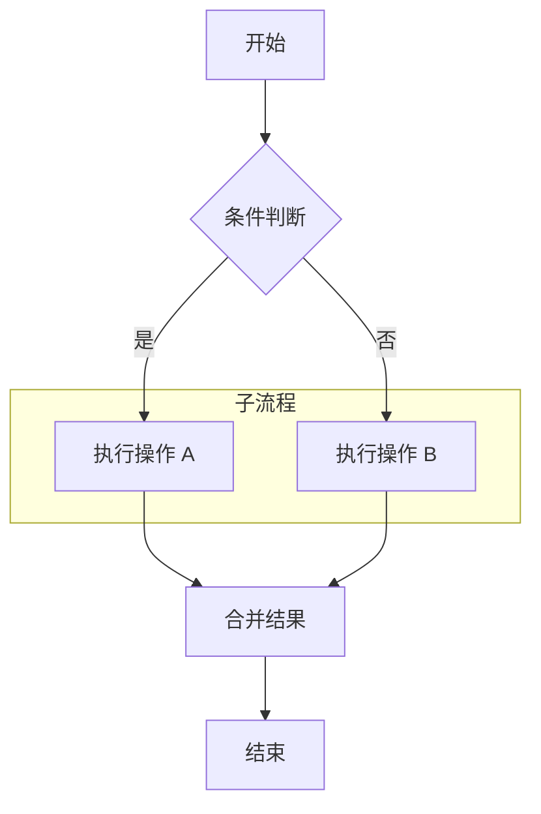

---

## 2. 时序图 (Sequence Diagram)

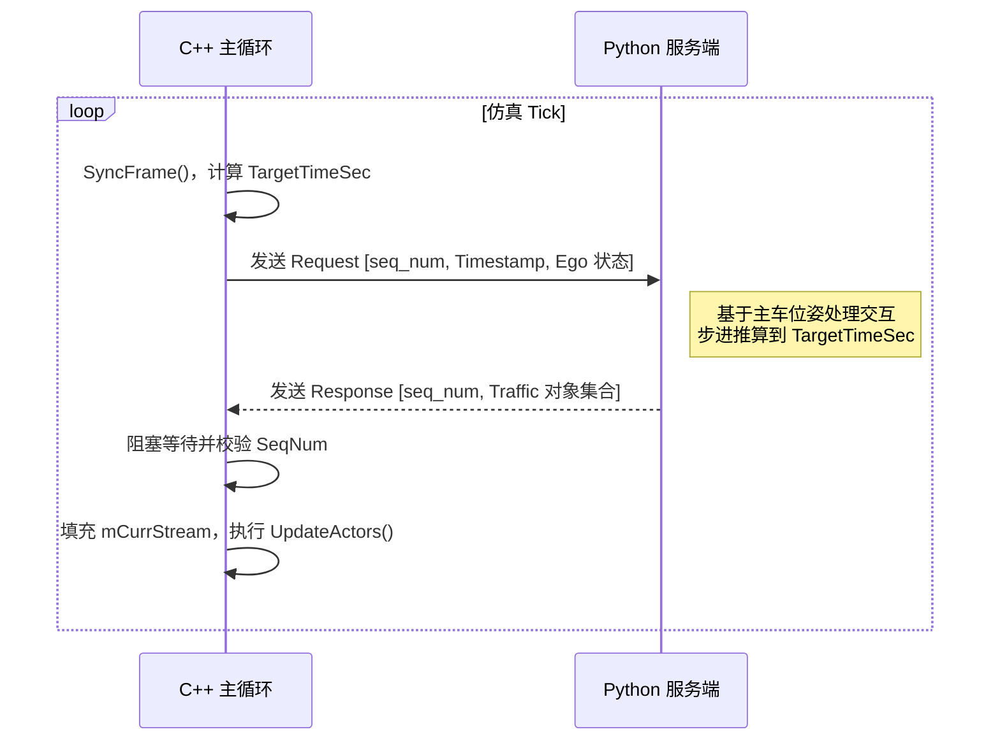

---

## 3. 甘特图 (Gantt)

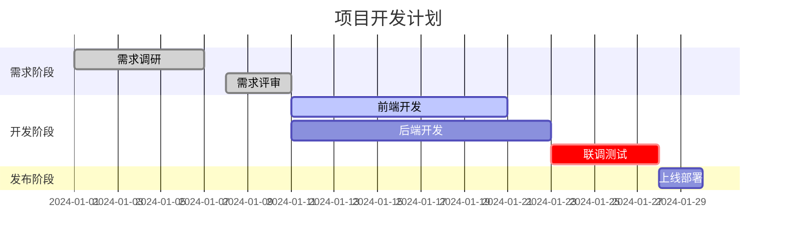

---

## 4. 饼图 (Pie Chart)

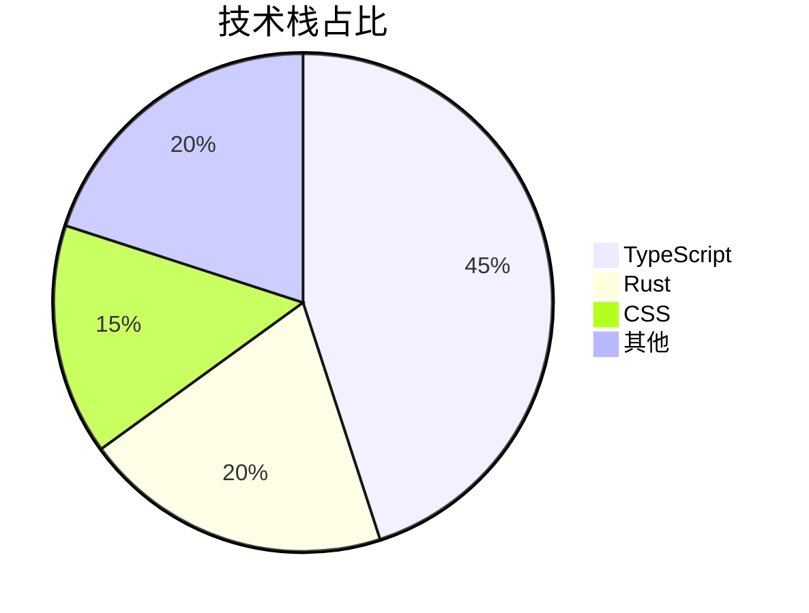

---

## 5. 类图 (Class Diagram)

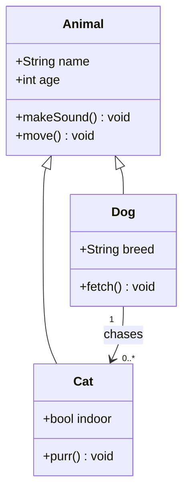

---

## 6. 状态图 (State Diagram)

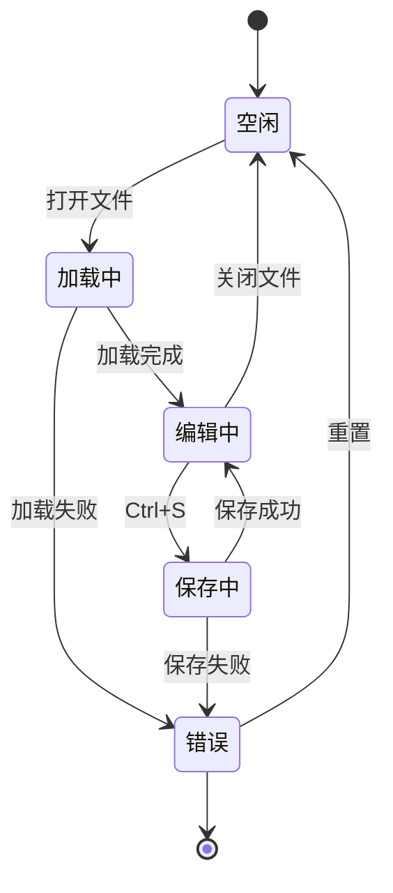

---

## 7. ER 图 (Entity Relationship)

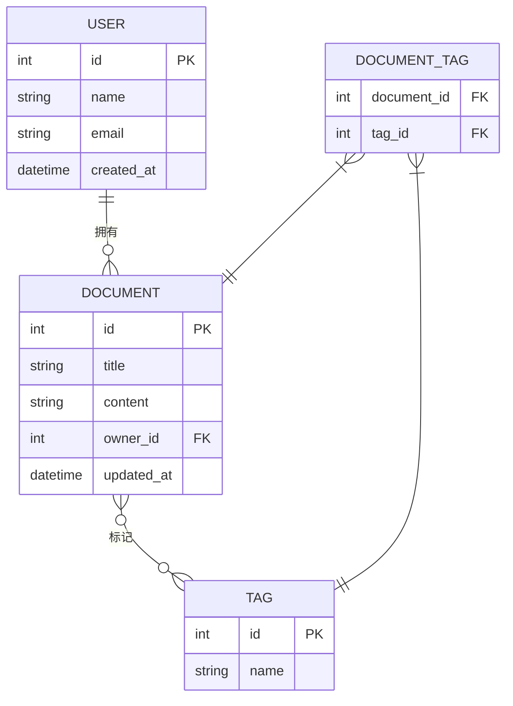

---

## 8. Git 图 (Git Graph)

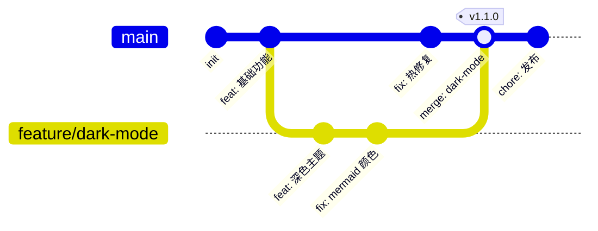

---

## 9. 思维导图 (Mindmap)

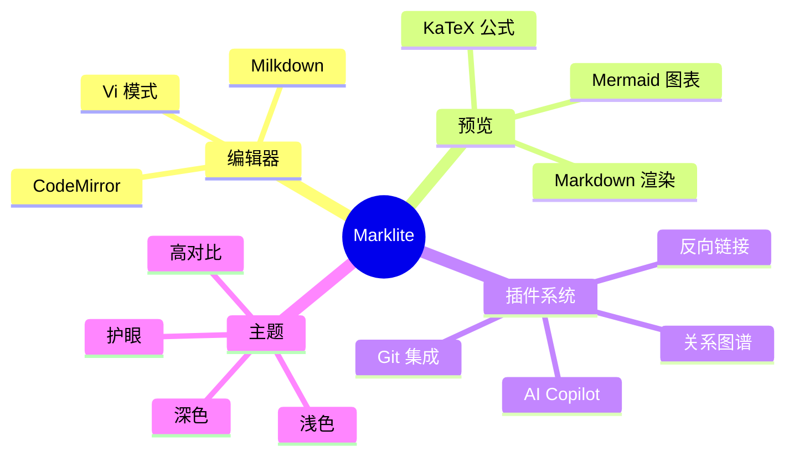

---

## 10. 时间线 (Timeline)

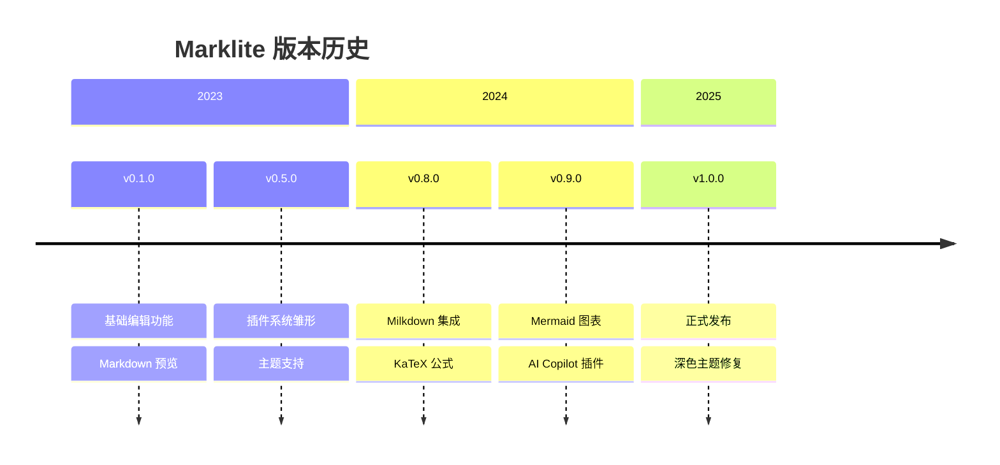

---

## 11. 象限图 (Quadrant Chart)

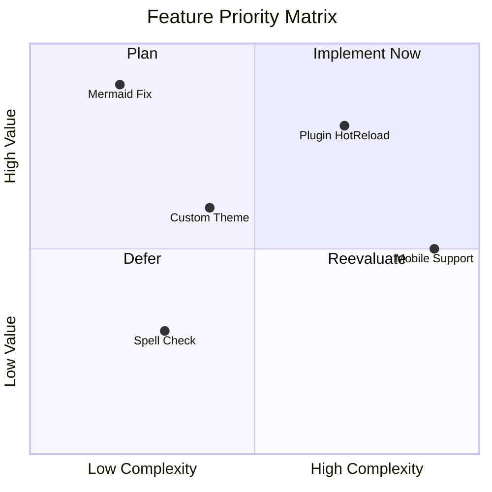

---

## 12. 块图 (Block Diagram)

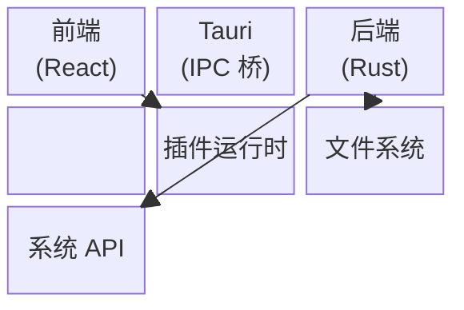
