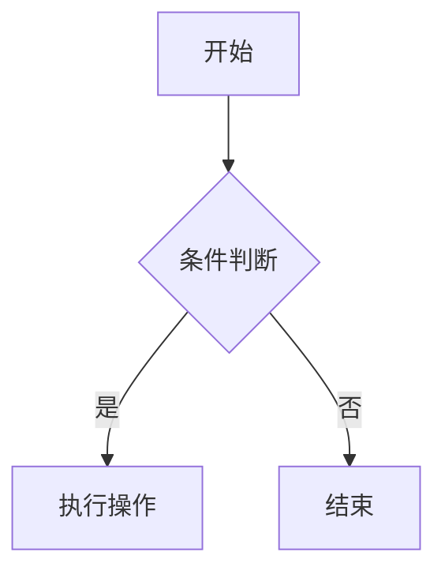
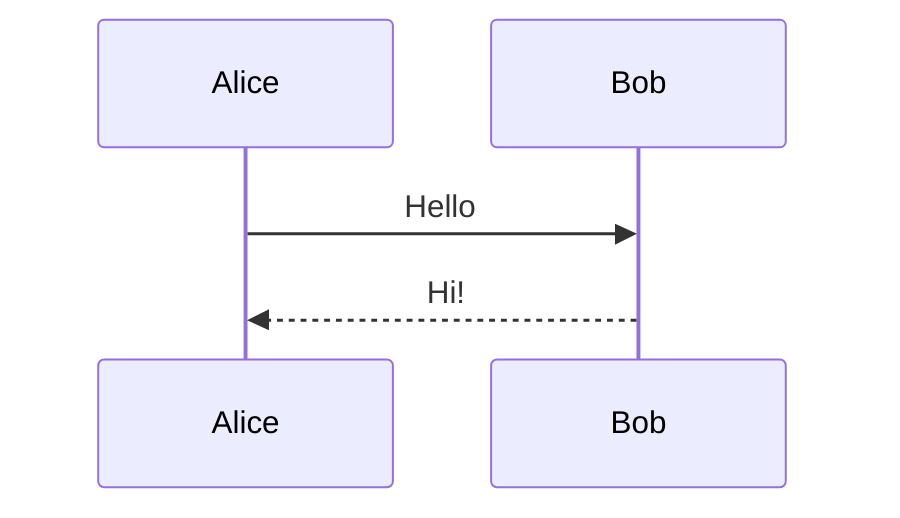
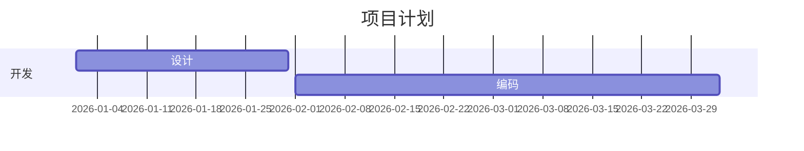

# MarkLite++ 插件使用手册

> **最后更新**：2026-05-03
> **MarkLite++ 版本**：v0.11.0（当前版本）

本文档详细介绍 MarkLite++ 全部 **18 个官方内置插件**的功能、使用方法和快捷键。

---

## 目录

- [快捷键总览](#快捷键总览)
- [1. AI Copilot — AI 辅助编辑](#1-ai-copilot--ai-辅助编辑)
- [2. Backlinks — 反向链接面板](#2-backlinks--反向链接面板)
- [3. Daily Notes — 每日笔记](#3-daily-notes--每日笔记)
- [4. Document Templates — 文档模板](#4-document-templates--文档模板)
- [5. File Icons — 文件图标](#5-file-icons--文件图标)
- [6. Frontmatter Editor — 前置数据编辑器](#6-frontmatter-editor--前置数据编辑器)
- [7. Git Integration — Git 集成](#7-git-integration--git-集成)
- [8. Graph View — 知识图谱](#8-graph-view--知识图谱)
- [9. KaTeX Math — 数学公式](#9-katex-math--数学公式)
- [10. Markdown Lint — 格式检查](#10-markdown-lint--格式检查)
- [11. Mermaid — 图表渲染](#11-mermaid--图表渲染)
- [12. Minimap — 代码缩略图](#12-minimap--代码缩略图)
- [13. PNG Export — 导出 PNG](#13-png-export--导出-png)
- [14. Smart Autocomplete — 智能补全](#14-smart-autocomplete--智能补全)
- [15. Table Editor Pro — 增强表格编辑](#15-table-editor-pro--增强表格编辑)
- [16. Tag System — 标签系统](#16-tag-system--标签系统)
- [17. Terminal — 内置终端](#17-terminal--内置终端)
- [18. Vim Mode — Vim 模式](#18-vim-mode--vim-模式)
- [应用内置快捷键](#应用内置快捷键)

---

## 快捷键总览

### 插件快捷键

| 快捷键 | 插件 | 功能 |
|--------|------|------|
| `Ctrl+D` | Daily Notes | 创建/打开当日笔记 |
| `Ctrl+Alt+I` | AI Copilot | 打开 AI 面板（应用级） |

### Vim 模式快捷键（启用 Vim 插件后生效）

| 快捷键 | 功能 |
|--------|------|
| `h` / `j` / `k` / `l` | 左 / 下 / 上 / 右 导航 |
| `i` / `a` / `o` | 进入插入模式 / 追加 / 新行 |
| `v` | 进入可视选择模式 |
| `dd` | 删除当前行 |
| `yy` / `p` | 复制行 / 粘贴 |
| `u` / `Ctrl+R` | 撤销 / 重做 |
| `:w` / `:q` / `:wq` | 保存 / 退出 / 保存并退出 |
| `/` | 搜索 |
| `w` / `b` | 按词前进 / 后退 |

### 终端内快捷键（启用 Terminal 插件后生效）

| 快捷键 | 功能 |
|--------|------|
| `Ctrl+C` | 取消 / 中断命令 |
| `Ctrl+U` | 清除当前行 |

---

## 1. AI Copilot — AI 辅助编辑

| 属性 | 值 |
|------|------|
| **插件 ID** | `marklite-ai-copilot` |
| **描述** | AI 辅助编辑 — 智能改写、解释、翻译、总结，支持本地模型和云端模型 |
| **激活时机** | 应用启动时 |
| **侧边栏面板** | AI Copilot (✨) |

### 使用方法

1. **打开面板**：点击侧边栏 ✨ 图标，或按 `Ctrl+Alt+I`
2. **输入指令**：在输入框中输入自然语言指令或斜杠命令
3. **右键菜单**：选中文本后右键，选择 AI 操作
4. **命令面板**：`Ctrl+Shift+P` 搜索 AI 命令

### 斜杠命令

| 命令 | 功能 |
|------|------|
| `/new` | 用 AI 创建新文档 |
| `/polish` | 润色优化选中文本 |
| `/explain` | 解释选中文本 |
| `/rewrite` | 重写选中文本 |
| `/summarize` | 总结当前文档 |
| `/translate` | 翻译选中文本 |
| `/format` | 格式化 Markdown 内容 |
| `/insert` | 在光标处生成并插入内容 |
| `/delete` | 删除选中文本或当前段落 |
| `/todo` | 生成 TODO 列表 |
| `/expand` | 扩展缩写内容 |
| `/toc` | 生成目录 |
| `/lint` | 检查 Markdown 格式问题 |
| `/fix-links` | 修复损坏的链接 |
| `/table-format` | 格式化表格 |
| `/heading-promote` | 调整标题层级 |

### 右键菜单操作（需先选中文本）

| 操作 | 说明 |
|------|------|
| ✨ AI 润色 | 优化选中文本的表达 |
| 📖 AI 解释 | 解释选中文本的含义 |
| 🌐 AI 翻译 | 翻译选中文本 |
| 📝 AI 总结 | 总结选中文本 |
| ↔️ AI 重写 | 重新组织选中文本 |

### 前置条件

需要在设置中配置 AI 提供商：
- **本地模型**：Ollama、LM Studio
- **云端模型**：配置 API Key

---

## 2. Backlinks — 反向链接面板

| 属性 | 值 |
|------|------|
| **插件 ID** | `marklite-backlinks` |
| **描述** | 显示当前文档的反向链接 — 查看哪些文档通过 `[[link]]` 引用了它 |
| **激活时机** | 工作区就绪时 |
| **侧边栏面板** | Backlinks (🔗) |

### 使用方法

1. 打开侧边栏的 **Backlinks** 面板
2. 自动扫描工作区中所有通过 `[[wikilink]]` 引用当前文档的文件
3. 文件变更时自动刷新

### 前置条件

- 需要在文档中使用 `[[双链]]` 语法
- 需要打开工作区（文件夹）

---

## 3. Daily Notes — 每日笔记

| 属性 | 值 |
|------|------|
| **插件 ID** | `marklite-daily-notes` |
| **描述** | 每日笔记 — 快速创建/打开当日笔记，支持模板变量 |
| **激活时机** | 应用启动时 |
| **侧边栏面板** | Daily Notes (📅) |
| **快捷键** | `Ctrl+D` |

### 使用方法

1. **快捷键**：按 `Ctrl+D` 立即创建或打开当天的笔记
2. **侧边栏**：打开 Daily Notes 面板查看最近的笔记列表
3. **命令面板**：`Ctrl+Shift+P` → "Open Daily Note"

### 文件存储

笔记保存在工作区的 `daily-notes/` 目录下，格式为 `YYYY-MM-DD.md`

### 模板变量

| 变量 | 说明 |
|------|------|
| `${date}` | 当前日期 |
| `${time}` | 当前时间 |
| `${datetime}` | 日期 + 时间 |
| `${filename}` | 文件名 |

---

## 4. Document Templates — 文档模板

| 属性 | 值 |
|------|------|
| **插件 ID** | `marklite-document-templates` |
| **描述** | 文档模板 — 新建文件时选择预定义模板，支持动态变量 |
| **激活时机** | 应用启动时 |
| **侧边栏面板** | Templates (📄) |

### 使用方法

1. 打开侧边栏 **Templates** 面板
2. 点击内置模板即可创建新文档
3. 支持创建、编辑、删除自定义模板
4. 命令面板：`Ctrl+Shift+P` → "New from Template"

### 内置模板

| 模板 | 说明 |
|------|------|
| 📋 Meeting Notes | 会议记录模板 |
| 🔧 Tech Doc | 技术文档模板 |
| 📔 Diary | 日记模板 |

### 模板变量

| 变量 | 说明 |
|------|------|
| `${date}` | 当前日期 |
| `${time}` | 当前时间 |
| `${filename}` | 文件名 |
| `${cursor}` | 光标初始位置 |

---

## 5. File Icons — 文件图标

| 属性 | 值 |
|------|------|
| **插件 ID** | `marklite-file-icons` |
| **描述** | 文件树按扩展名显示语言颜色图标 |
| **激活时机** | 应用启动时 |

### 使用方法

启用后**自动生效**，无需任何操作。文件树中的文件将根据扩展名显示对应的语言彩色图标。

### 支持的文件类型（100+）

Markdown、JavaScript/TypeScript、Python、Go、Rust、Java、C/C++、HTML/CSS、JSON/YAML、图片、配置文件等。

---

## 6. Frontmatter Editor — 前置数据编辑器

| 属性 | 值 |
|------|------|
| **插件 ID** | `marklite-frontmatter-editor` |
| **描述** | 可视化 YAML Frontmatter 编辑器 |
| **激活时机** | 应用启动时 |
| **侧边栏面板** | Frontmatter ({}) |

### 使用方法

1. 打开侧边栏 **Frontmatter** 面板
2. 自动解析文档顶部的 `---` YAML 块
3. 以键值对形式展示元数据

### 类型标记

| 图标 | 类型 |
|------|------|
| 🔤 | 字符串 (string) |
| #️⃣ | 数字 (number) |
| ✅ | 布尔 (boolean) |
| 📋 | 数组 (array) |
| ∅ | 空值 (null) |

### 示例

在文档顶部添加 YAML Frontmatter：

```yaml
---
title: 我的文档
tags: [笔记, 教程]
date: 2026-05-03
draft: false
---
```

---

## 7. Git Integration — Git 集成

| 属性 | 值 |
|------|------|
| **插件 ID** | `marklite-git` |
| **描述** | 内置 Git 面板 — 分支信息、变更列表、Diff 查看、提交/推送/拉取 |
| **激活时机** | 工作区就绪时 |
| **侧边栏面板** | Source Control (🔀) |

### 使用方法

1. 打开侧边栏 **Source Control** 面板
2. 查看当前分支和远程同步状态
3. 文件变更列表显示修改/新增/删除/重命名/冲突状态

### 支持的操作

| 操作 | 说明 |
|------|------|
| 暂存 (Stage) | 将文件添加到暂存区 |
| 取消暂存 (Unstage) | 将文件从暂存区移除 |
| 查看 Diff | 查看文件的差异对比 |
| 提交 (Commit) | 提交暂存的文件 |
| 推送 (Push) | 推送到远程仓库 |
| 拉取 (Pull) | 从远程仓库拉取 |

### 前置条件

- 工作区必须是 Git 仓库
- 系统需安装 Git

---

## 8. Graph View — 知识图谱

| 属性 | 值 |
|------|------|
| **插件 ID** | `marklite-graph-view` |
| **描述** | 双向链接知识图谱可视化 — 交互式节点图展示笔记间的链接关系 |
| **激活时机** | 工作区就绪时 |
| **侧边栏面板** | Graph (🔗) |

### 使用方法

1. 打开侧边栏 **Graph** 面板
2. 自动可视化工作区中所有 `[[wikilink]]` 的链接关系
3. 以力导向布局渲染交互式节点图
4. **点击节点**可直接跳转到对应文件

### 前置条件

- 需要在文档中使用 `[[双链]]` 语法
- 需要打开工作区

---

## 9. KaTeX Math — 数学公式

| 属性 | 值 |
|------|------|
| **插件 ID** | `marklite-katex` |
| **描述** | 数学公式渲染 — 支持 LaTeX 行内公式和块级公式 |
| **激活时机** | 应用启动时 |

### 使用方法

启用后**自动生效**，在 Markdown 中直接书写 LaTeX 数学公式。

### 语法

**行内公式**：使用单个 `$` 包裹

```markdown
这是行内公式 $E = mc^2$，嵌入在文本中。
```

**块级公式**：使用 `$$` 包裹

```markdown
$$
\int_{0}^{\infty} e^{-x^2} dx = \frac{\sqrt{\pi}}{2}
$$
```

---

## 10. Markdown Lint — 格式检查

| 属性 | 值 |
|------|------|
| **插件 ID** | `marklite-markdown-lint` |
| **描述** | Markdown 格式检查 — 标题风格、列表缩进、空行规则 |
| **激活时机** | 打开 `.md` 文件时 |

### 使用方法

启用后**自动生效**，打开 Markdown 文件时自动进行格式检查，诊断信息以内联标记的形式显示在编辑器中。

### 检查规则

| 规则 | 严重级别 | 说明 |
|------|----------|------|
| 标题风格一致性 | ⚠️ 警告 | ATX (`#`) 与 Setext (`===`) 风格不能混用 |
| 列表缩进 | ⚠️ 警告 | 禁止使用 Tab，缩进需为 2 空格的倍数 |
| 标题前后空行 | ⚠️ 警告 | 标题前后应有空行 |
| 列表前空行 | ℹ️ 信息 | 列表前建议留空行 |
| 标题尾部 `#` | ℹ️ 信息 | 建议移除 ATX 标题末尾的 `#` |

---

## 11. Mermaid — 图表渲染

| 属性 | 值 |
|------|------|
| **插件 ID** | `marklite-mermaid` |
| **描述** | Mermaid 图表渲染 — 流程图、时序图、甘特图、思维导图 |
| **激活时机** | 应用启动时 |

### 使用方法

在 Markdown 中使用 ` ```mermaid ` 代码块编写图表定义，预览区自动渲染为 SVG 图形。

### 示例

**流程图**：

````markdown

````

**时序图**：

````markdown

````

**甘特图**：

````markdown

````

### 特性

- 自动检测深色/浅色主题
- 延迟加载 Mermaid 库（~1.8MB）
- 安全级别设为 `strict`

---

## 12. Minimap — 代码缩略图

| 属性 | 值 |
|------|------|
| **插件 ID** | `marklite-minimap` |
| **描述** | CodeMirror minimap — 右侧代码缩略图导航 |
| **激活时机** | 应用启动时 |

### 使用方法

启用后**自动生效**，编辑器右侧显示文档的缩略图视图（类似 VS Code 的 minimap）。

- **点击**缩略图可快速跳转到对应位置
- **拖拽**缩略图进行导航

---

## 13. PNG Export — 导出 PNG

| 属性 | 值 |
|------|------|
| **插件 ID** | `marklite-png-export` |
| **描述** | 将预览区导出为 PNG 图片 |
| **激活时机** | 应用启动时 |

### 使用方法

1. 切换到预览模式（`Ctrl+3`）或分屏模式（`Ctrl+2`）
2. 通过导出功能触发 PNG 导出
3. 选择保存路径

### 特性

- 使用 `html2canvas` 以 2 倍分辨率截取预览区
- 通过 Tauri 后端命令保存文件

---

## 14. Smart Autocomplete — 智能补全

| 属性 | 值 |
|------|------|
| **插件 ID** | `marklite-smart-autocomplete` |
| **描述** | 智能代码补全 — 文件路径补全、代码片段、上下文感知建议 |
| **激活时机** | 应用启动时 |

### 使用方法

启用后**自动生效**，在编辑器中输入时自动触发补全建议。

### 文件路径补全

在任意位置输入 `./` 或 `../` 即可触发工作区文件/文件夹的路径补全，支持目录逐级浏览。

### 代码片段补全

在代码块中根据语言自动提供代码片段：

| 语言 | 片段示例 |
|------|----------|
| JavaScript | `console.log`、`import`、`export`、`async`、`Promise` |
| TypeScript | `interface`、`type`、`enum`、泛型 |
| Python | `def`、`class`、`import`、`with`、`try/except` |
| Go | `package`、`func`、`struct`、`interface`、`goroutine` |

---

## 15. Table Editor Pro — 增强表格编辑

| 属性 | 值 |
|------|------|
| **插件 ID** | `marklite-table-editor-pro` |
| **描述** | 增强表格编辑器 — 可视化编辑、行列增删、对齐调整、排序、拖拽调整列宽 |
| **激活时机** | 应用启动时 |
| **侧边栏面板** | 表格编辑器 Pro (📊) |

### 使用方法

1. 将光标放在 Markdown 表格内
2. **右键菜单**：显示表格操作选项
3. **侧边栏面板**：可视化编辑表格

### 右键菜单操作

| 操作 | 说明 |
|------|------|
| 列左对齐 | 设置当前列左对齐 |
| 列居中对齐 | 设置当前列居中 |
| 列右对齐 | 设置当前列右对齐 |
| 插入行 | 在选中行下方或末尾插入新行 |
| 删除选中行 | 删除当前选中的行 |
| 插入列 | 在末尾插入新列 |
| 删除最后一列 | 删除最后一列 |
| 升序排列 | 按第一列升序排序 |
| 降序排列 | 按第一列降序排序 |
| 上移行 | 将选中行上移 |
| 下移行 | 将选中行下移 |

### 特性

- 支持拖拽调整列宽
- 实时同步编辑器中的 Markdown 表格源码

---

## 16. Tag System — 标签系统

| 属性 | 值 |
|------|------|
| **插件 ID** | `marklite-tag-system` |
| **描述** | 标签系统 — 扫描文档中的 `#标签`，提供标签云导航 |
| **激活时机** | 工作区就绪时 |
| **侧边栏面板** | Tags (#) |

### 使用方法

1. 打开侧边栏 **Tags** 面板
2. 自动扫描工作区所有文档中的 `#hashtag` 标签
3. 以标签云形式展示，点击标签可查看相关文档
4. 文件变更时自动刷新

### 标签语法

在 Markdown 中使用 `#` 后跟标签名：

```markdown
这是一段文本 #笔记 #教程 #Markdown
```

---

## 17. Terminal — 内置终端

| 属性 | 值 |
|------|------|
| **插件 ID** | `marklite-terminal` |
| **描述** | 内置终端 — 底部面板集成 shell 终端 |
| **激活时机** | 应用启动时 |
| **侧边栏面板** | Terminal (💻) |

### 使用方法

1. 打开侧边栏 **Terminal** 面板
2. 命令面板：`Ctrl+Shift+P` → "Toggle Terminal"
3. 使用内嵌的 shell 终端执行命令

### 终端内快捷键

| 快捷键 | 功能 |
|--------|------|
| `Ctrl+C` | 取消/中断当前命令 |
| `Ctrl+U` | 清除当前输入行 |

### 特性

- 基于 xterm.js 实现
- 通过 Tauri 后端与系统 shell 通信

---

## 18. Vim Mode — Vim 模式

| 属性 | 值 |
|------|------|
| **插件 ID** | `marklite-vim` |
| **描述** | Vim 键盘映射 — hjkl 导航、dd 删除行等 |
| **激活时机** | 应用启动时 |

### 使用方法

启用插件后，编辑器自动切换为 Vim 模式。基于 `@replit/codemirror-vim` 实现。

### 常用快捷键

#### 模式切换

| 快捷键 | 功能 |
|--------|------|
| `i` | 进入插入模式（在光标前） |
| `a` | 进入插入模式（在光标后） |
| `o` | 在下方新开一行并进入插入模式 |
| `O` | 在上方新开一行并进入插入模式 |
| `v` | 进入可视模式 |
| `V` | 进入行可视模式 |
| `Esc` | 返回普通模式 |

#### 导航

| 快捷键 | 功能 |
|--------|------|
| `h` / `j` / `k` / `l` | 左 / 下 / 上 / 右 |
| `w` / `b` | 按词前进 / 后退 |
| `0` / `$` | 行首 / 行尾 |
| `gg` / `G` | 文件首 / 文件尾 |
| `Ctrl+D` / `Ctrl+U` | 半页下翻 / 半页上翻 |

#### 编辑

| 快捷键 | 功能 |
|--------|------|
| `dd` | 删除当前行 |
| `dw` | 删除一个词 |
| `yy` | 复制当前行 |
| `p` / `P` | 在光标后/前粘贴 |
| `x` | 删除光标处字符 |
| `r` | 替换光标处字符 |
| `u` | 撤销 |
| `Ctrl+R` | 重做 |
| `.` | 重复上一次操作 |

#### 命令模式

| 命令 | 功能 |
|------|------|
| `:w` | 保存文件 |
| `:q` | 退出 |
| `:wq` | 保存并退出 |
| `:%s/old/new/g` | 全局替换 |

---

## 应用内置快捷键

以下是 MarkLite++ 应用级的默认快捷键（非插件），所有快捷键均可在设置中自定义。

### 文件操作

| 快捷键 | 功能 |
|--------|------|
| `Ctrl+N` | 新建标签页 |
| `Ctrl+O` | 打开文件 |
| `Ctrl+S` | 保存文件 |
| `Ctrl+Shift+S` | 另存为 |
| `Ctrl+W` | 关闭标签页 |
| `Ctrl+Tab` | 切换到下一标签页 |
| `Ctrl+Shift+Tab` | 切换到上一标签页 |
| `Ctrl+Alt+W` | 关闭所有标签页 |

### 编辑操作

| 快捷键 | 功能 |
|--------|------|
| `Ctrl+F` | 查找替换 |
| `Ctrl+Z` | 撤销 |
| `Ctrl+Y` | 重做 |
| `Alt+D` | 选中所有相同文本 |
| `Alt+↑` | 在上方添加光标 |
| `Alt+↓` | 在下方添加光标 |
| `Ctrl+Shift+J` | 插入代码片段 |
| `Ctrl+Shift+.` | 折叠/展开代码块 |

### 格式操作

| 快捷键 | 功能 |
|--------|------|
| `Ctrl+B` | **加粗** |
| `Ctrl+I` | *斜体* |
| `Ctrl+Shift+X` | ~~删除线~~ |
| `` Ctrl+` `` | `行内代码` |
| `Ctrl+K` | 插入链接 |
| `Ctrl+Shift+I` | 插入图片 |
| `Ctrl+Shift+O` | 有序列表 |
| `Ctrl+Shift+U` | 无序列表 |
| `Ctrl+Shift+Q` | 引用块 |
| `Ctrl+Shift+-` | 水平分割线 |

### 视图切换

| 快捷键 | 功能 |
|--------|------|
| `Ctrl+1` | 编辑模式 |
| `Ctrl+2` | 分屏模式 |
| `Ctrl+3` | 预览模式 |
| `Ctrl+4` | 思维导图模式 |
| `Ctrl+.` | 打字机模式 |
| `Ctrl+,` | 聚焦模式 |
| `F11` | 全屏 |

### 面板切换

| 快捷键 | 功能 |
|--------|------|
| `Alt+1` | 切换文件树 |
| `Alt+2` | 切换目录大纲 |
| `Alt+3` | 切换搜索面板 |
| `Alt+5` | 切换插件面板 |
| `Ctrl+Alt+I` | 切换 AI 面板 |
| `Ctrl+Shift+P` | 命令面板 |
| `Ctrl+P` | 快速打开文件 |
| `Ctrl+Shift+E` | 在文件树中定位当前文件 |

---

> **提示**：所有应用级快捷键均可在 **设置 → 快捷键** 中自定义修改。Mac 用户将 `Ctrl` 替换为 `Cmd`。
